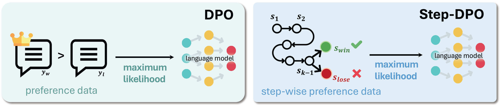
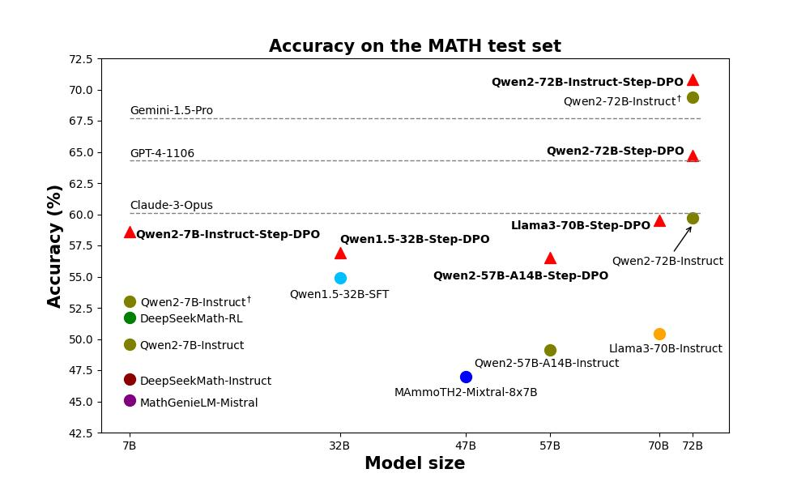
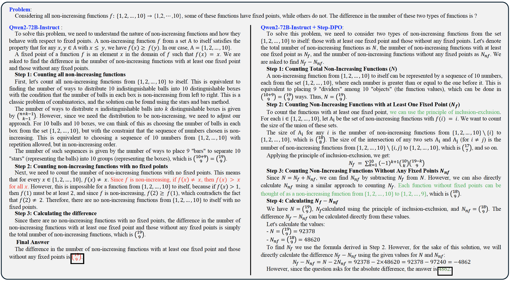
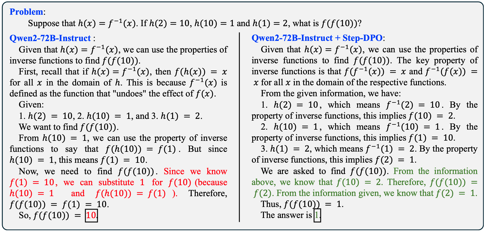
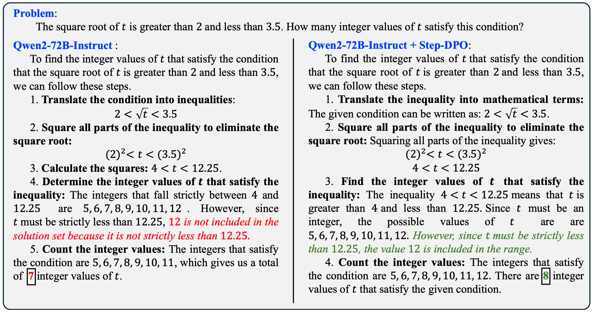

# Step-DPO: Step-wise Preference Optimization for Long-chain Reasoning of LLMs
[Xin Lai](https://scholar.google.com/citations?user=tqNDPA4AAAAJ&hl),
[Zhuotao Tian](https://scholar.google.com/citations?user=mEjhz-IAAAAJ&hl),
[Yukang Chen](https://scholar.google.com/citations?user=6p0ygKUAAAAJ&hl),
[Senqiao Yang](https://scholar.google.com/citations?user=NcJc-RwAAAAJ&hl),
[Xiangru Peng](xxxx),
[Jiaya Jia](https://scholar.google.com/citations?user=XPAkzTEAAAAJ&hl=en)
 

[](https://huggingface.co/xinlai/Qwen2-72B-Instruct-Step-DPO)
[](https://huggingface.co/datasets/xinlai/Math-Step-DPO-10K)
[](https://arxiv.org/pdf/2406.18629)
[](http://103.170.5.190:7870/)

[](licenses/LICENSE)
[](licenses/DATA_LICENSE)
[](licenses/WEIGHT_LICENSE)

This repo provides the implementation of **Step-DPO**, a simple, effective, and data-efficient method for boosting the long-chain reasoning ability of LLMs, with **a data construction pipeline** that yields a **high-quality dataset** containing 10K step-wise preference pairs.

Notably, **Step-DPO** boosts the performance of **Qwen2-7B-Instruct** from **53.0%** to **58.6%** on MATH, and **85.5%** to **87.9%** on GSM8K, with as few as **10K data** and **hundreds of training steps**!

Moreover, **Step-DPO**, when applied to **Qwen2-72B-Instruct**, achieves scores of **70.8%** and **94.0%** on the test sets of **MATH** and **GSM8K**, respectively, **surpassing a series of closed-source models** without bells and wistles, including GPT-4-1106, Claude-3-Opus, and Gemini-1.5-Pro.



## TABLE OF CONTENTS
1. [News](#news)
2. [Datasets](#datasets)
3. [Models](#models)
4. [Installation](#installation)
5. [Training](#training)
6. [Evaluation](#evaluation)
7. [Deployment](#deployment)
8. [Examples](#examples)
9. [Acknowledgement](#acknowledgement)
10. [Citation](#citation)

## News
- [x] [2024.7.1] We release the demo of the model [Qwen2-7B-Instruct-Step-DPO](https://huggingface.co/xinlai/Qwen2-7B-Instruct-Step-DPO). Welcome to try it on [Demo](http://103.170.5.190:7870/)!
- [x] [2024.6.28] We release the pre-print of [Step-DPO](https://arxiv.org/pdf/2406.18629) and this GitHub repo, including training/evaluation scripts, pre-trained models and data.

## Datasets

We build a 10K math preference datasets for Step-DPO, which can be downloaded from the following link.

| Dataset                  | Size   | Link                                                         |
| ------------------------ | ------ | ------------------------------------------------------------ |
| xinlai/Math-Step-DPO-10K | 10,795 | [Hugging Face](https://huggingface.co/datasets/xinlai/Math-Step-DPO-10K) |

## Models

It is notable that the model **Qwen2-72B-Instruct + Step-DPO** could achieve **70.8%** and **94.0%** on MATH and GSM8K test sets. Step-DPO also brings considerable improvement over various models as follows. Welcome to download and use.

|              Models              | Size | MATH | GSM8K | Odyssey-MATH |                            Link                             |
| :------------------------------ | :--: | :----: | :---: | :---: | :----------------------------------------------------------: |
|         Qwen2-7B-Instruct          |  7B  | 53.0 | 85.5  | - |                              -                               |
|    **Qwen2-7B-Instruct + Step-DPO**    |  7B  | **58.6 (+5.6)** | **87.9 (+2.4)** |  -  | [HF](https://huggingface.co/xinlai/Qwen2-7B-Instruct-Step-DPO) |
|         DeepSeekMath-RL          |  7B  | 51.7 | 88.2  | - |                              -                               |
|    **DeepSeekMath-RL + Step-DPO**    |  7B  | **53.2 (+1.5)** | **88.7 (+0.5)** |  -  | [HF](https://huggingface.co/xinlai/DeepSeekMath-RL-Step-DPO) |
|           Qwen2-7B-SFT           |  7B  | 54.8 | 88.2  |  -  |  [HF](https://huggingface.co/xinlai/Qwen2-7B-SFT)      |
|     **Qwen2-7B-SFT + Step-DPO**      |  7B  | **55.8 (+1.0)** | **88.5 (+0.3)**  | - |[HF](https://huggingface.co/xinlai/Qwen2-7B-SFT-Step-DPO) |
|         Qwen1.5-32B-SFT          | 32B  | 54.9 | 90.0  |  -  | [HF](https://huggingface.co/xinlai/Qwen1.5-32B-SFT)    |
|    **Qwen1.5-32B-SFT + Step-DPO**    | 32B  | **56.9 (+2.0)** | **90.9 (+0.9)**  |  - |[HF](https://huggingface.co/xinlai/Qwen1.5-32B-SFT-Step-DPO) |
|        Qwen2-57B-A14B-SFT        | 57B  | 54.6 | 89.8  |  - | [HF](https://huggingface.co/xinlai/Qwen2-57B-A14B-SFT)   |
|  **Qwen2-57B-A14B-SFT + Step-DPO**   | 57B  | **56.5 (+1.9)** | **90.0 (+0.2)**  |  - |[HF](https://huggingface.co/xinlai/Qwen2-57B-A14B-SFT-Step-DPO) |
|         Llama-3-70B-SFT          | 70B  | 56.9 | 92.2  |  - |   [HF](https://huggingface.co/xinlai/Llama-3-70B-SFT)    |
|    **Llama-3-70B-SFT + Step-DPO**    | 70B  | **59.5 (+2.6)** | **93.3 (+1.1)**  |  - |[HF](https://huggingface.co/xinlai/Llama-3-70B-SFT-Step-DPO) |
|          Qwen2-72B-SFT           | 72B  | 61.7 | 92.9  |  44.2  |   [HF](https://huggingface.co/xinlai/Qwen2-72B-SFT)     |
|     **Qwen2-72B-SFT + Step-DPO**     | 72B  | **64.7 (+3.0)** | **93.9 (+1.0)**  | **47.0 (+2.8)** | [HF](https://huggingface.co/xinlai/Qwen2-72B-SFT-Step-DPO) |
|        Qwen2-72B-Instruct        | 72B  | 69.4 | 92.4 | 47.0 |                              -                               |
|  **Qwen2-72B-Instruct + Step-DPO**   | 72B  | **70.8 (+1.4)** | **94.0 (+1.6)**  | **50.1 (+3.1)** | [HF](https://huggingface.co/xinlai/Qwen2-72B-Instruct-Step-DPO) |

Note: **Odyssey-MATH** consists of competition-level math problems.

## Installation
```
conda create -n step_dpo python=3.10
conda activate step_dpo

pip install -r requirements.txt
```

## Training

### Pre-trained weights
We use Qwen2, Qwen1.5, Llama-3, and DeepSeekMath models as the pre-trained weights and fine-tune them with Step-DPO. Download based on your choices.

| Pre-trained weights                                                        |
|:---------------------------------------------------------------------------|
| [xinlai/DeepSeekMath-Base-SFT](https://huggingface.co/xinlai/DeepSeekMath-Base-SFT)           |
| [deepseek-ai/deepseek-math-7b-rl](https://huggingface.co/deepseek-ai/deepseek-math-7b-rl)           |
| [xinlai/Qwen2-7B-SFT](https://huggingface.co/xinlai/Qwen2-7B-SFT)         |
| [xinlai/Qwen1.5-32B-SFT](https://huggingface.co/xinlai/Qwen1.5-32B-SFT)         |
| [xinlai/Qwen2-57B-A14B-SFT](https://huggingface.co/xinlai/Qwen2-57B-A14B-SFT) |
| [xinlai/Llama-3-70B-SFT](https://huggingface.co/xinlai/Llama-3-70B-SFT)         |
| [xinlai/Qwen2-72B-SFT](https://huggingface.co/xinlai/Qwen2-72B-SFT)         |
| [Qwen/Qwen2-72B-Instruct](https://huggingface.co/Qwen/Qwen2-72B-Instruct)         |

**Note**: models with '-SFT' are supervised fine-tuned by our 299K SFT data based on open-source base models. You could perform Step-DPO on either our SFT models or existing open-source instruct models.

### Fine-tuning

Here is a script example to perform Step-DPO on `Qwen/Qwen2-72B-Instruct`:

```shell
ACCELERATE_LOG_LEVEL=info accelerate launch --config_file accelerate_configs/deepspeed_zero3_cpu.yaml --mixed_precision bf16 \
    --num_processes 8 \
    train.py configs/config_full.yaml \
    --model_name_or_path="Qwen/Qwen2-72B-Instruct" \
    --data_path="xinlai/Math-Step-DPO-10K" \
    --per_device_train_batch_size=2 \
    --gradient_accumulation_steps=8 \
    --torch_dtype=bfloat16 \
    --bf16=True \
    --beta=0.4 \
    --num_train_epochs=4 \
    --save_strategy='steps' \
    --save_steps=200 \
    --save_total_limit=1 \
    --output_dir=outputs/qwen2-72b-instruct-step-dpo \
    --hub_model_id=qwen2-72b-instruct-step-dpo \
    --prompt=qwen2-boxed
```

## Evaluation

Here are script examples to evaluate fine-tuned models on both GSM8K and MATH test sets:
```
python eval_math.py \
    --model outputs/qwen2-72b-instruct-step-dpo \
    --data_file ./data/test/GSM8K_test_data.jsonl \
    --save_path 'eval_results/gsm8k/qwen2-72b-instruct-step-dpo.json' \
    --prompt 'qwen2-boxed' \
    --tensor_parallel_size 8
```

```
python eval_math.py \
    --model outputs/qwen2-72b-instruct-step-dpo \
    --data_file ./data/test/MATH_test_data.jsonl \
    --save_path 'eval_results/math/qwen2-72b-instruct-step-dpo.json' \
    --prompt 'qwen2-boxed' \
    --tensor_parallel_size 8
```

## Deployment

For deployment, please directly use the following command:
```
python3 app.py --model_path_or_name xinlai/Qwen2-7B-Instruct-Step-DPO
```


## Examples







## Acknowledgement

This repository is based on [alignment-handbook](https://github.com/huggingface/alignment-handbook), [DeepSeekMath](https://github.com/deepseek-ai/DeepSeek-Math), and [MetaMath](https://github.com/meta-math/MetaMath). 

Many thanks for their efforts!

## Citation
If you find this project useful in your research, please consider citing us:

```
@article{lai_stepdpo,
  title={Step-DPO: Step-wise Preference Optimization for Long-chain Reasoning of LLMs},
  author={Xin Lai and Zhuotao Tian and Yukang Chen and Senqiao Yang and Xiangru Peng and Jiaya Jia},
  journal={arXiv:2406.18629},
  year={2024}
}
```
